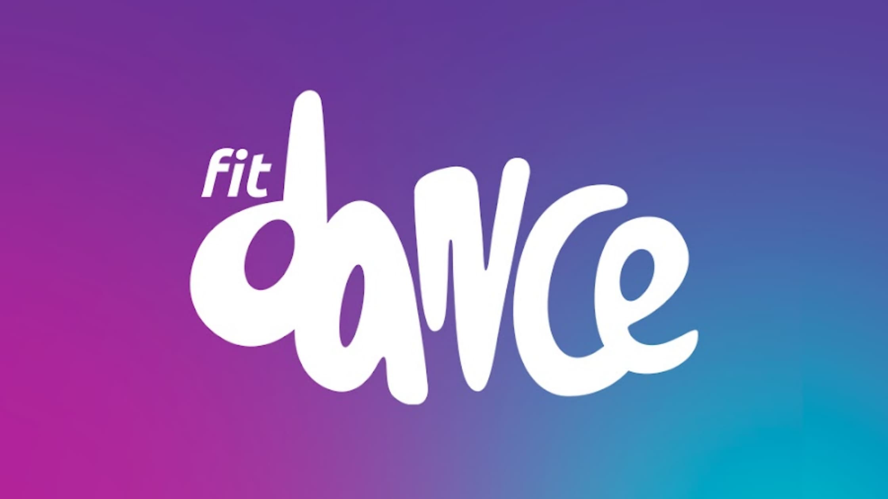

<div style='display: flex; align-items: center; justify-content: center; text-align: center; width="100%"'>
  
</div>


<h1 align="center" style="margin-top: 50px;">PROJETO FIT DANCE</h1>

  

## 📝Descrição do Projeto

Este repositório fornece um back-end que deverá ser integrado à sua página. A API foi construida utilizando um framework RPC chamado [sdkgen](https://sdkgen.github.io/). Para mais detalhes, veja a documentação e os detalhes na seção de instruções abaixo. O projeto de back-end foi construído em Node 20, utilizando typescript e [Yarn PnP](https://yarnpkg.com/features/pnp). Para executar os scripts do projeto, utilize Yarn v4 ou superior. Veja instruções em [Starting with Yarn](https://yarnpkg.com/getting-started/install). A API fornece ações simples para gestão de usuários, descritas nos arquivos de especificação de API do sdkgen. O back-end está pré-carregado com 100 cadastros gerados programaticamente. Não será necessário criar cadastros antes de utilizar a API.


## 🔨 Tecnologias usadas para a construção do Front-End


- [React](https://pt-br.reactjs.org/) O React é uma biblioteca JavaScript declarativa, eficiente e flexível para a criação de interfaces de usuário interativas. Utilizando uma abordagem baseada em componentes, o React facilita o desenvolvimento de aplicativos web modernos, oferecendo uma renderização eficiente e uma experiência de usuário aprimorada.

- [Vite](https://vitejs.dev/) O Vite é um construtor de aplicativos web extremamente rápido para o desenvolvimento moderno de front-end. Com um sistema de construção baseado em ESM (ECMAScript Modules), o Vite oferece um tempo de desenvolvimento instantâneo e otimizações eficientes para a produção, tornando-o uma escolha ideal para projetos React.

- [TypeScript](https://www.typescriptlang.org/) O TypeScript é uma linguagem de programação de código aberto que estende o JavaScript, adicionando tipagem estática opcional e outros recursos avançados. Ao ser usado no desenvolvimento de APIs, o TypeScript fornece uma base sólida para construir aplicativos escaláveis e robustos, oferecendo maior segurança e facilidade de manutenção por meio de verificações de tipo estático e uma sintaxe mais expressiva.

- [Styled Components](https://styled-components.com/) O Styled Components é uma biblioteca popular para estilização de componentes React utilizando tagged template literals. Ele permite que você escreva estilos diretamente em seus componentes, facilitando a criação de interfaces visualmente atraentes e modularização de estilos no desenvolvimento React.

- [react-hook-form](https://react-hook-form.com/) O react-hook-form é uma biblioteca React para gerenciar formulários de maneira eficiente e fácil. Ele oferece um conjunto de hooks personalizáveis que simplificam a lógica de formulários, tornando o processo de coleta e validação de dados uma tarefa mais simplificada e eficiente.

- [react-query](https://react-query.tanstack.com/) O react-query é uma biblioteca de gerenciamento de estado para React que simplifica a gestão de dados remotos, como chamadas de API. Com recursos como caching, invalidação automática e refetching, o react-query oferece uma solução eficaz para integrar dados dinâmicos em aplicativos React.

- [react-input-mask](https://www.npmjs.com/package/react-input-mask) O react-input-mask é uma biblioteca React que facilita a aplicação de máscaras a campos de entrada de texto, proporcionando uma experiência de usuário mais intuitiva e consistente ao formatar automaticamente os dados inseridos.

- [react-icons](https://react-icons.github.io/react-icons/) O react-icons é uma biblioteca React que fornece uma ampla variedade de ícones de diferentes conjuntos de ícones populares. Isso facilita a adição de ícones visualmente atraentes aos componentes React, melhorando a estética e a usabilidade do aplicativo.


- [Yup](https://www.npmjs.com/package/yup) Utilizado como uma biblioteca de validação de esquemas, o Yup oferece uma maneira simples e robusta de validar dados de entrada, garantindo a integridade e consistência das informações fornecidas pelos usuários durante o processo de cadastro e atualização de perfil.


## 🚀 PARA RODAR A API 👇👇👇
``` bash 
# Entrar na pasta 
\fit_Dance\teste-frontend

# instale o SDKGEN
npm i @sdkgen/node-runtime

# instale o SDKGEN TYPES
npm i --save-dev typescript @sdkgen/cli

# instale as denpendências
yarn install

# gere a api
yarn gen:api

# gere a api do client
yarn gen:client

# gera a build da aplicação
yarn build

# Execute a api
yarn start


```


## 🚀 Para rodar o Front-End  👇👇👇
``` bash 
# Entre na pasta 
\fit_Dance\fit_dance_front>

# instale as denpendências
npm  install

# Rodar o projeto
npm run dev

```
